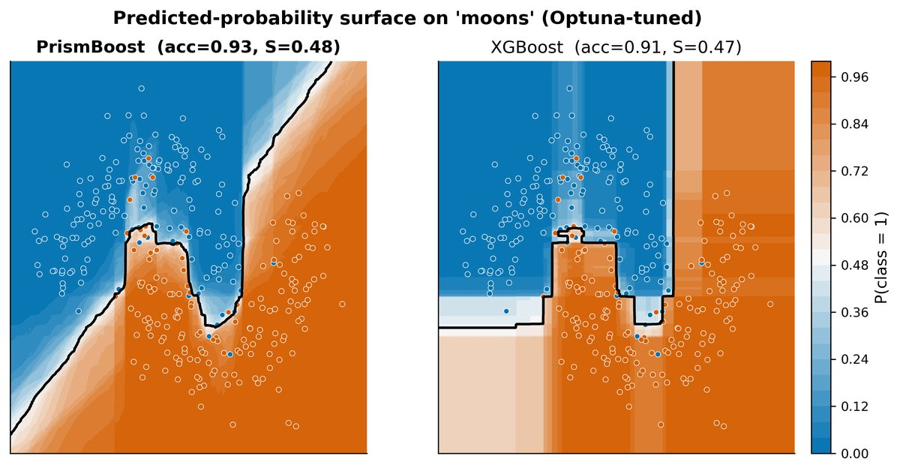
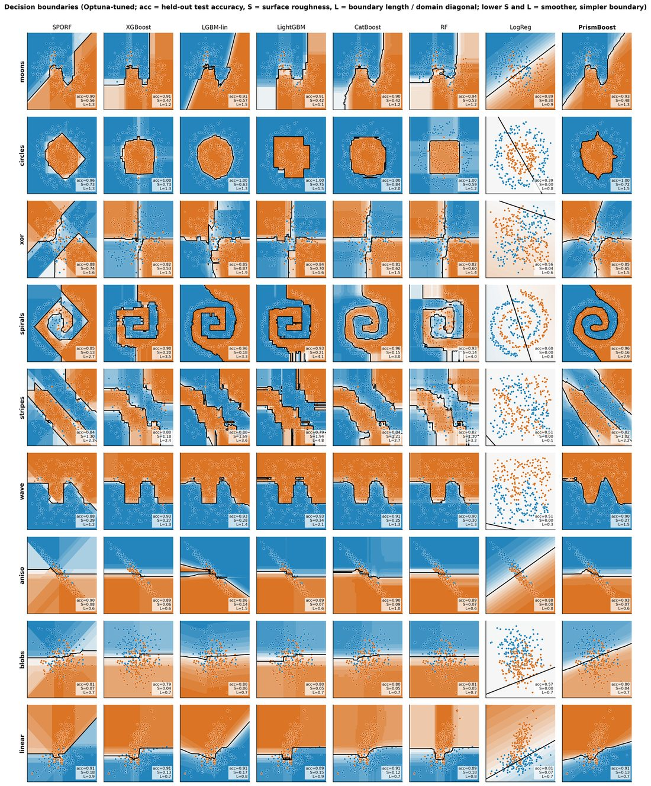
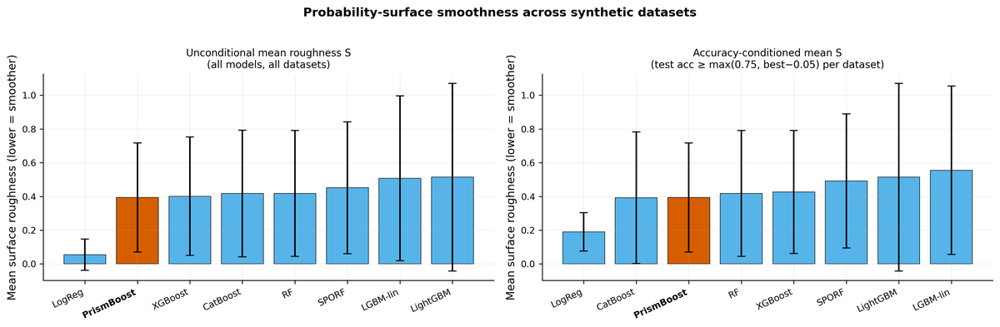
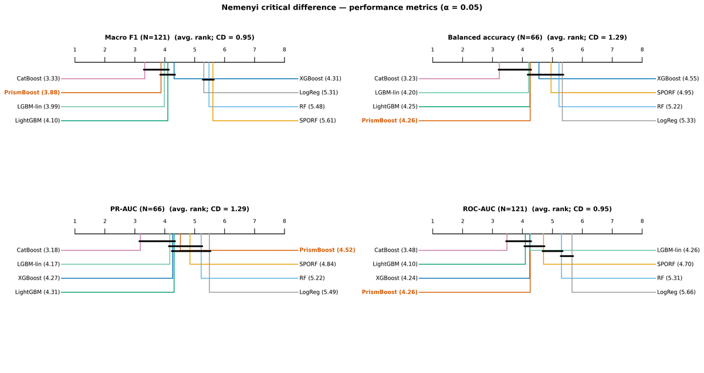

# PrismBoost

[](https://pypi.org/project/prismboost/)
[](https://pypi.org/project/prismboost/)
[](https://github.com/PrismBoost/PrismBoost/blob/main/LICENSE)

**PrismBoost** is a gradient-boosting classifier/regressor that uses **SEFR oblique splits** at internal nodes (hyperplane splits instead of axis-aligned thresholds), with an optional fast C++ backend.

```python
from prismboost import PrismBoostClassifier
from sklearn.datasets import load_breast_cancer
from sklearn.model_selection import train_test_split

X, y = load_breast_cancer(return_X_y=True)
X_train, X_test, y_train, y_test = train_test_split(
    X, y, test_size=0.2, random_state=0, stratify=y
)

clf = PrismBoostClassifier(random_state=0)   # capacity parameters adapt to the data
clf.fit(X_train, y_train)
print(clf.score(X_test, y_test))
print(clf.auto_config_)                      # what was chosen for this training set
```

## Adaptive defaults

Every capacity parameter defaults to `"auto"` and is resolved from the training-set shape at `fit` time, the way CatBoost adapts its learning rate to dataset size. The rules were calibrated on the per-dataset Optuna optima of the 121 PMLB benchmark datasets, so an untuned model starts near a sensible configuration instead of one fixed point that under-fits large data and over-fits small data.

| Parameter | `"auto"` rule |
|-----------|---------------|
| `n_estimators` | 200 |
| `learning_rate` | 0.05 below 500 rows, else 0.1 (keeps `learning_rate * n_estimators` near the tuned optimum) |
| `max_depth` | 4 below 500 rows, else 6 |
| `min_samples_leaf` | `sqrt(n_samples) / 2`, clipped to `[5, 30]` |
| `min_samples_split` | `2 * min_samples_leaf` |
| `subsample` | 0.8, or 1.0 below 100 rows |
| `split_mode` | `hybrid` up to 50 features, else `hybrid_sampled` |

Only the shape of `X` is used, never `y`, so folds of equal size resolve identically and no label information leaks. Passing an explicit value disables adaptation for that parameter alone:

```python
clf = PrismBoostClassifier(max_depth=3, random_state=0)  # depth fixed, the rest still auto
clf.fit(X_train, y_train)
clf.max_depth_, clf.n_estimators_   # (3, 200)
```

Class imbalance is deliberately left alone (`class_weight=None`), matching XGBoost and CatBoost defaults. To reproduce pre-0.2 behaviour, pass the old values explicitly: `n_estimators=100, learning_rate=0.1, max_depth=3, min_samples_leaf=10, min_samples_split=2, subsample=1.0, split_mode="hybrid_sampled"`.

## Why oblique boosting?

Axis-aligned GBDTs approximate curved boundaries with staircases. PrismBoost fits **linear (oblique) splits**, so decision surfaces on non-linear problems are typically smoother.

<p align="center">
  
</p>

<p align="center"><em>Predicted-probability surfaces on moons: PrismBoost (left) vs XGBoost (right).</em></p>

<p align="center">
  
</p>

<p align="center"><em>Decision boundaries on six synthetic 2D datasets (rows) across classifiers (columns). Lower surface roughness <code>S</code> is smoother.</em></p>

<p align="center">
  
</p>

## Benchmark highlights (PMLB)

Evaluated on **121** Penn Machine Learning Benchmark classification datasets against strong baselines (CatBoost, LightGBM, LightGBM-linear, XGBoost, SPORF, Random Forest, Logistic Regression). Hyperparameters are tuned with Optuna; scores are repeated stratified CV.

**Median scores** (higher is better for F1 / ROC-AUC; lower is better for inference latency):

| Model | Median macro-F1 | Median ROC-AUC | Median inference (ms/row) |
|-------|----------------:|---------------:|-------------------------:|
| **PrismBoost** | **0.903** | 0.976 | **0.056** |
| CatBoost | 0.892 | **0.976** | 0.184 |
| XGBoost | 0.875 | 0.970 | 0.615 |
| LightGBM-linear | 0.875 | 0.970 | 0.567 |
| LightGBM | 0.870 | 0.972 | 0.550 |
| Random Forest | 0.862 | 0.964 | 5.140 |
| SPORF | 0.856 | 0.970 | 10.058 |
| Logistic Regression | 0.822 | 0.942 | 0.053 |

**Average ranks** (1 = best; Friedman tests significant for macro-F1 and ROC-AUC):

| Model | Macro-F1 rank | ROC-AUC rank |
|-------|--------------:|-------------:|
| CatBoost | **3.33** | **3.48** |
| **PrismBoost** | **3.88** | 4.26 |
| LightGBM-linear | 3.99 | 4.26 |
| LightGBM | 4.10 | 4.10 |
| XGBoost | 4.31 | 4.24 |
| Logistic Regression | 5.31 | 5.66 |
| Random Forest | 5.48 | 5.31 |
| SPORF | 5.61 | 4.70 |

<p align="center">
  
</p>

<p align="center"><em>Nemenyi critical-difference diagrams (α = 0.05). Models connected by a bar are not significantly different.</em></p>

On these data, PrismBoost is competitive with modern GBDTs on accuracy while remaining among the **fastest at inference** (second only to logistic regression; fastest non-linear model by median latency).

## Install

```bash
pip install prismboost
```

Requires Python 3.10–3.13. A C++17 compiler and CMake are used when building the optional native extension (included for common platforms via wheels / sdist build).

From source (editable / development):

```bash
pip install -e ".[dev]"
```

If the C++ extension fails to build, the package still works via the pure-Python backend.

Extras:

```bash
pip install "prismboost[examples]"   # Optuna for the tuning example
pip install "prismboost[dev]"        # pytest, ruff
```

## Public API

| Name | Description |
|------|-------------|
| `PrismBoostClassifier` | Primary classifier (sklearn-compatible) |
| `PrismBoostRegressor` | Primary regressor |
| `SEFRBoostClassifier` / `SEFRBoostRegressor` | Compatibility aliases |
| `SEFR` | Linear weak learner used inside oblique splits |
| `auto_boosting_config(n_samples, n_features)` | The `"auto"` default rules, callable for inspection |

## Features

- Oblique tree splits from SEFR (closed-form linear separator)
- Binary and multiclass classification; regression
- Optional C++ backend for faster fit/predict
- sklearn estimator API (`fit`, `predict`, `predict_proba`, pipelines, pickling)
- Works with Optuna / GridSearchCV / RandomizedSearchCV

## Examples

```bash
pip install "prismboost[examples]"
python examples/quickstart.py
python examples/optuna_tuning.py --n-trials 20
```

- [`examples/quickstart.py`](examples/quickstart.py) — minimal fit / score
- [`examples/optuna_tuning.py`](examples/optuna_tuning.py) — Optuna CV search over trees, depth, learning rate, `split_mode`, and scaler

Docs mirror: [`docs/optuna_tuning.rst`](docs/optuna_tuning.rst).

## Tests

```bash
pip install -e ".[dev]"
pytest -q
```

## License

This project is licensed under the [MIT License](https://github.com/PrismBoost/PrismBoost/blob/main/LICENSE).

Third-party note: `prismboost._utils` includes code derived from [wnb](https://github.com/msamogh/wnb) under the [BSD 3-Clause License](https://github.com/PrismBoost/PrismBoost/blob/main/src/prismboost/licenses/BSD-3-Clause.txt).

## Citation

If you use PrismBoost in academic work, please cite the accompanying paper (to be updated on publication).

## Authors

- Hamidreza Keshavarz
- Reza Rawassizadeh
